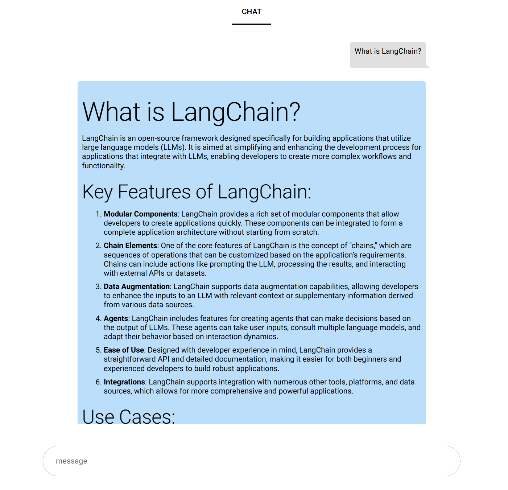

# AI chat with OpenAI, LangChain and NiceGUI



## Local dev setup with UV and VSCode
```
cd openai_nicegui_chat

# Enter your LangChain and OpenAI PATs
export LANGCHAIN_API_KEY=?????
export OPENAI_API_KEY=?????

# Create .env
sh -c "cat > $HOME/$APP/.env" <<EOG
HOME="$HOME"
APP="$APP"
LANGCHAIN_API_KEY="$LANGCHAIN_API_KEY"
LANGCHAIN_TRACING_V2="true"
OPENAI_API_KEY="$OPENAI_API_KEY"
EOG

# Create a virtual environment with UV
python_version=$(python3 --version | awk '{print $2}')
uv venv --env-file .env --python $python_version
uv sync  

# Start VSCode
code .
```
Run the "Debug Main" launch configuration

## Deploy to AWS Lightsail with Github Actions
1. Obtain an AWS access key and secret with Lightsail permssions.
2. Add Github Actions variables to the repository: AWS_DEFAULT_REGION \
DEV_AWS_ACCESS_KEY_ID \
PROD_AWS_ACCESS_KEY_ID
4. Create a Github PAT for this repository with appropriate permissions.
3. Add Github Actions secrets to the repository: 
DEV_AWS_SECRET_ACCESS_KEY \
PROD_AWS_SECRET_ACCESS_KEY \
GH_PAT \
LANGCHAIN_API_KEY \
OPENAI_API_KEY
4. Create an EC2 as an Github Actions Runner.
5. Create an AWS S3 Bucket and DynamoDB table for Terraform state management.
6. Update the Terraform backend-dev.tfvars and backend-prod.tfvars with the S3 and DynamoDB attributes.
7. Update the Github repository URL in terraform/instance.tf
8. Commit changes
9. Using the Github console run Actions main.yaml script
10. Monitor with the AWS Lightsail console.
11. Open Lightsail instance public ip in browswer with port 8080
